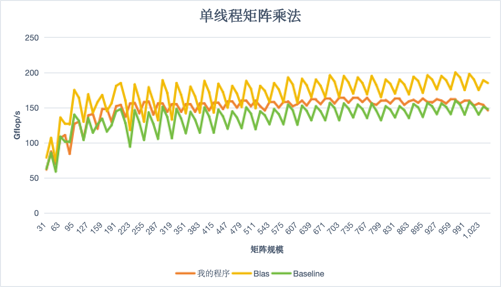

# 单线程矩阵乘法

## 性能优化

### 编译选项

代码编译时从O级别变成O3级别，提升代码整体性能。

同时添加 ``-march=native``编译选项，使得编译器自行根据体系结构优化

这个提升根据矩阵规模带来的性能提升不同，

矩阵大小为31的矩阵Gflops从42.5提升为61.8, 提升约40%.

矩阵大小为1025的矩阵Gflops从69.8提升为146，提升约100%.

随着矩阵大小越大，系统性能提升的越多。

### 矩阵分块

针对之前对三个维度各个维度均采用BLOCK_SIZE的思路，本算法这里结合后面的算法kernel设计了各个维度分块大小，如下面代码所示。

```c
#define M_SIZE (32)
#define K_SIZE (256)
#define N_SIZE (8)
for (int k = 0; k < lda; k += K_SIZE) {
    int K = min(K_SIZE, lda - k);
    //packing row data
    packing_matrix_row(...);

    for (int i = 0; i < lda; i += M_SIZE) {
        int M = min(M_SIZE, lda - i);
        //packing column data
        packing_matrix_col(...);

        for (int j = 0; j < lda; j += N_SIZE) {
            int N = min(N_SIZE, lda - j);
            //calculate the matrix
            avx512_MxKxN(...);
        }
    }
}
```

设置 ``M_SIZE``为32的原因是后面用的kernel大小行数均为32或者31，``N_SIZE``为8的原因是后面的kernel大小行数为8和7。

``K_SIZE``的值考虑的是能进入L2 cache(总共1280K)。

分块可以有效利用数据的连续性。

### 矩阵乘法kernel

矩阵乘法需要处理特定的数据，考虑到矩阵规模均为$32k$、$32k - 1$和$32k + 1$的矩阵，因此考虑使用下面六种kernel:

* 32xKx8
* 32xKx7
* 32xKx1
* 31xKx8
* 31xKx7
* 31xKx1

针对列的变化设计的kernel原理比较，针对行的两大类kernel在数据打包和计算时需要特殊处理。

在用这六种kernel处理完后，剩余的计算量最多为1xKxN，直接用最基本的方式计算就可以。

```c
static inline void kernel_32xKx8_512_packing(int lda, int K, float* packing_A, float* packing_B, float* C) {
    //do calculte ...
}

static inline void kernel_32xKx7_512_packing(int lda, int K, float* packing_A, float* packing_B, float* C) {
    //do calculte ...
}

static inline void kernel_32xKx1_512_packing(int lda, int K, float* packing_A, float* packing_B, float* C) {
    //do calculte ...
}

static inline void kernel_31xKx8_512_packing(int lda, int K, float* packing_A, float* packing_B, float* C) {
    //do calculte ...
}

static inline void kernel_31xKx7_512_packing(int lda, int K, float* packing_A, float* packing_B, float* C) {
    //do calculte ...
}

static inline void kernel_31xKx1_512_packing(int lda, int K, float* packing_A, float* packing_B, float* C) {
    //do calculte ...
}
```

整体分类架构如下面代码所示：

```c
static inline void avx512_MxKxN(int lda, int M, int N, int K, float* buffer_A, float* A, float* buffer_B, float* B, float* C) {
    if (M == 32) {
        if (N == 8) {
            kernel_32xKx8_512_packing(lda, K, buffer_A, buffer_B, C);
        }
        else if (N == 7) {
            kernel_32xKx7_512_packing(lda, K, buffer_A, buffer_B, C);
        }
        else if (N == 1) {
            kernel_32xKx1_512_packing(lda, K, buffer_A, buffer_B, C);
        }
    }
    else if (M == 31) {
        if (N == 8) {
            kernel_31xKx8_512_packing(lda, K, buffer_A, buffer_B, C);
        }
        else if (N == 7) {
            kernel_31xKx7_512_packing(lda, K, buffer_A, buffer_B, C);
        }
        else if (N == 1) {
            kernel_31xKx1_512_packing(lda, K, buffer_A, buffer_B, C);
        }
    }
    else {
        // basic matrix power
        for (int j = 0; j < N; ++j)
        {
            float cij = C[index(0, j)];
            for (int k = 0; k < K; ++k)
                cij += A[index(0, k)] * B[index(k, j)];
            C[index(0, j)] = cij;
        }
    }
}
```

### 向量化

针对32xKx8矩阵乘法kernel，我们考虑采用512位向量化的方式加速计算。

我们将列32拆成两个16位向量，每个向量的每一维元素都是一个float类型的数，这两个向量计算方式是类似的，我们以前1个向量做为介绍。

取出坐标为$A(i,k)$的向下16个元素组成的列向量

$$
a = [A(i, k), A(i + 1), k] ..., A(i + 15, k)]^T
$$

考虑$B(k,j)$位置的元素，将其复制扩展为16个相同的元素的行向量

$$
b = [B(k, j), B(k, j) ..., B(k, j)]
$$

这两个向量$ab$做点积会产生对列向量

$$
c = [C(i, k), C(i + 1), k] ..., C(i + 15, k)]^T
$$

乘积贡献，这里采用向量化方式将这16个值同时存入。遍历$[0, K -1]$中所有的元素k，代码如下面所示，这样就形成了一个16xKx1 kernel:

```c
static inline void kernel_16xKx1_512_packing(int lda, int K, float* packing_A, float* packing_B, float* C) {
    __m512 c_00 = _mm512_setzero_ps();
    prefetch_T0(C);
    __m512 a_0, a_1;
    __m512 b_0, b_1, b_2, b_3, b_4, b_5, b_6, b_7;
    int k = 0;
    for (k = 0; k < K; k++) {
        a_0 = _mm512_loadu_ps(packing_A + k * 32);
        b_0 = _mm512_set1_ps(*(packing_B + 0));
        c_00 = _mm512_fmadd_ps(a_0, b_0, c_00);
        packing_B ++;
    }
    _m512_y_add_to_x(C, c_00);
}
```

将其按照行和列扩展，就产生了32xKx8 kernel：

```c
static inline void kernel_32xKx8_512_packing(int lda, int K, float* packing_A, float* packing_B, float* C) {
    __m512 c_00 = _mm512_setzero_ps();
    __m512 c_10 = _mm512_setzero_ps();
    __m512 c_20 = _mm512_setzero_ps();
    __m512 c_30 = _mm512_setzero_ps();
    __m512 c_40 = _mm512_setzero_ps();
    __m512 c_50 = _mm512_setzero_ps();
    __m512 c_60 = _mm512_setzero_ps();
    __m512 c_70 = _mm512_setzero_ps();
    __m512 c_01 = _mm512_setzero_ps();
    __m512 c_11 = _mm512_setzero_ps();
    __m512 c_21 = _mm512_setzero_ps();
    __m512 c_31 = _mm512_setzero_ps();
    __m512 c_41 = _mm512_setzero_ps();
    __m512 c_51 = _mm512_setzero_ps();
    __m512 c_61 = _mm512_setzero_ps();
    __m512 c_71 = _mm512_setzero_ps();
    __m512 a_0, a_1;
    __m512 b_0, b_1, b_2, b_3, b_4, b_5, b_6, b_7;
    int k = 0;
    for (k = 0; k < K; k++) {
        a_0 = _mm512_loadu_ps(packing_A + k * 32);
        a_1 = _mm512_loadu_ps(packing_A + k * 32 + 16);
        b_0 = _mm512_set1_ps(*(packing_B + 0));
        c_00 = _mm512_fmadd_ps(a_0, b_0, c_00);
        c_01 = _mm512_fmadd_ps(a_1, b_0, c_01);
        b_1 = _mm512_set1_ps(*(packing_B + 1));
        c_10 = _mm512_fmadd_ps(a_0, b_1, c_10);
        c_11 = _mm512_fmadd_ps(a_1, b_1, c_11);
        b_2 = _mm512_set1_ps(*(packing_B + 2));
        c_20 = _mm512_fmadd_ps(a_0, b_2, c_20);
        c_21 = _mm512_fmadd_ps(a_1, b_2, c_21);
        b_3 = _mm512_set1_ps(*(packing_B + 3));
        c_30 = _mm512_fmadd_ps(a_0, b_3, c_30);
        c_31 = _mm512_fmadd_ps(a_1, b_3, c_31);
        b_4 = _mm512_set1_ps(*(packing_B + 4));
        c_40 = _mm512_fmadd_ps(a_0, b_4, c_40);
        c_41 = _mm512_fmadd_ps(a_1, b_4, c_41);
        b_5 = _mm512_set1_ps(*(packing_B + 5));
        c_50 = _mm512_fmadd_ps(a_0, b_5, c_50);
        c_51 = _mm512_fmadd_ps(a_1, b_5, c_51);
        b_6 = _mm512_set1_ps(*(packing_B + 6));
        c_60 = _mm512_fmadd_ps(a_0, b_6, c_60);
        c_61 = _mm512_fmadd_ps(a_1, b_6, c_61);
        b_7 = _mm512_set1_ps(*(packing_B + 7));
        c_70 = _mm512_fmadd_ps(a_0, b_7, c_70);
        c_71 = _mm512_fmadd_ps(a_1, b_7, c_71);
        packing_B += 8;
    }
    _m512_y_add_to_x(C, c_00);
    _m512_y_add_to_x(C + 16, c_01);
    _m512_y_add_to_x(C + index(0, 1), c_10);
    _m512_y_add_to_x(C + index(0, 1) + 16, c_11);
    _m512_y_add_to_x(C + index(0, 2), c_20);
    _m512_y_add_to_x(C + index(0, 2) + 16, c_21);
    _m512_y_add_to_x(C + index(0, 3), c_30);
    _m512_y_add_to_x(C + index(0, 3) + 16, c_31);
    _m512_y_add_to_x(C + index(0, 4), c_40);
    _m512_y_add_to_x(C + index(0, 4) + 16, c_41);
    _m512_y_add_to_x(C + index(0, 5), c_50);
    _m512_y_add_to_x(C + index(0, 5) + 16, c_51);
    _m512_y_add_to_x(C + index(0, 6), c_60);
    _m512_y_add_to_x(C + index(0, 6) + 16, c_61);
    _m512_y_add_to_x(C + index(0, 7), c_70);
    _m512_y_add_to_x(C + index(0, 7) + 16, c_71);
}
```

这里的宏 ``_m512_y_add_to_x(x, y)``含义如下面代码所示，采用向量化语句先将数据取出再加回去。

```c
#define _m512_y_add_to_x(x, y) _mm512_storeu_ps((x), _mm512_add_ps((y), _mm512_loadu_ps((x))))
```

对于31xKx8 kernel，需要做的是一个在数据打包过程中类似于32xKx8在第二个列向量上添加一个为0的float，同时在最后存数据时采用 ``_mm512_mask_storeu_ps``原语不写回最后一位向量，如下面代码所示：

```c
#define _m512_y_add_to_x_15(x, y) _mm512_mask_storeu_ps((x), 0x7FFF, _mm512_add_ps((y), _mm512_loadu_ps((x))))

static inline void kernel_31xKx8_512_packing(int lda, int K, float* packing_A, float* packing_B, float* C) {
    ...
    // the front code is same with 32xKx8, now is the different
    _m512_y_add_to_x(C, c_00);
    _m512_y_add_to_x_15(C + 16, c_01);
    _m512_y_add_to_x(C + index(0, 1), c_10);
    _m512_y_add_to_x_15(C + index(0, 1) + 16, c_11);
    _m512_y_add_to_x(C + index(0, 2), c_20);
    _m512_y_add_to_x_15(C + index(0, 2) + 16, c_21);
    _m512_y_add_to_x(C + index(0, 3), c_30);
    _m512_y_add_to_x_15(C + index(0, 3) + 16, c_31);
    _m512_y_add_to_x(C + index(0, 4), c_40);
    _m512_y_add_to_x_15(C + index(0, 4) + 16, c_41);
    _m512_y_add_to_x(C + index(0, 5), c_50);
    _m512_y_add_to_x_15(C + index(0, 5) + 16, c_51);
    _m512_y_add_to_x(C + index(0, 6), c_60);
    _m512_y_add_to_x_15(C + index(0, 6) + 16, c_61);
    _m512_y_add_to_x(C + index(0, 7), c_70);
    _m512_y_add_to_x_15(C + index(0, 7) + 16, c_71);
}
```

针对矩阵规模为32的矩阵，采用32xKx8的kernel的Gflops为107，基于普通矩阵乘法的速度为6.91，性能提升了1448%。

向量化可以充分利用硬件水平，使得CPU在流水线上发挥最大的效果。

### 数据预取

通过在kernel里面添加prefetch语言原语，将数据提前加载到cache，这样可以有效提升数据读取的速度，减少cache miss的次数。

```c
static inline void kernel_32xKx8_512_packing(int lda, int K, float* packing_A, float* packing_B, float* C) {
    // inital variable...
    prefetch_T0(C);
    prefetch_T0(C + index(0, 1));
    prefetch_T0(C + index(0, 2));
    prefetch_T0(C + index(0, 3));
    prefetch_T0(C + index(0, 4));
    prefetch_T0(C + index(0, 5));
    prefetch_T0(C + index(0, 6));
    prefetch_T0(C + index(0, 7));
    // calculte C...
}
```

### 数据打包(packing)

数据打包的方式需要按照设计的kernel对应实现，针对矩阵A和矩阵B的数据打包方式是不一样的。

矩阵A的数据打包方式按照32行为一个单元进行打包，如下列表: $[A(0,0), A(1, 0), A(2, 0) ... A(30, 0), A(31, 0), A(0, 1), A(1, 1), A(2, 1)... A(31, 0) ...]$

在最后不到32行的位置，需要补全为32行才能使用31xKxN的kernel：$[A(i, 0), A(i + 1, 0), A(i + 2, 0) ... A(i + 14, 0), 0, A(i, 1), A(i + 1, 1) ... A(i + 14, 0), 0 ...]$，这两个部分组成矩阵A的数据打包方式。

矩阵B的打包方式按照每8列为单位进行打包，如下列表：$[B(0, 0), B(0, 1), B(0, 2) ... B(0, 7), B(1, 0), B(1, 1) ... B(1, 7) ...]$

在最后不到8列的位置，不需要补全直接按照行进行打包即可：$[B(0, i), B(0, i + 1) ... B(0, i + 6), B(1, i), B(1, i + 1) ... B(1, i + 6) ...]$，这两个部分组成数据打包。

代码如下图所示：

```c
矩阵B的数据打包方式
static inline void packing_matrix_row(float* src, float* dst, int lda, int K, int N) {
    float* s0;
    for (int j = 0; j < N_8; j += 8) {
        for (int i = 0; i < K; i++) {
            s0 = src + index(i, j);
            *dst++ = *s0;
            s0 += lda;
            *dst++ = *s0;
            s0 += lda;
            *dst++ = *s0;
            s0 += lda;
            *dst++ = *s0;
            s0 += lda;
            *dst++ = *s0;
            s0 += lda;
            *dst++ = *s0;
            s0 += lda;
            *dst++ = *s0;
            s0 += lda;
            *dst++ = *s0;
            s0 += lda;
        }
    }
    for (int i = 0; i < K; i++) {
        s0 = src + index(i, N_8);
        for (int j = N_8; j < N; j++) {
            *dst++ = *s0;
            s0 += lda;
        }
    }
}

矩阵A的数据打包方式，采用AVX512优化
static inline void packing_matrix_col(float* src, float* dst, int lda, int M, int K) {
    int M_32 = M & -32, M_16 = M & -16, M_8 = M & -8;
    int cnt = 0;
    float* cur_src = src, * cur_dst = dst;
    for (int i = 0; i < M_32; i += 32) {
        cur_src = src + i;
        for (int j = 0; j < K; ++j) {
            // memcpy(cur_dst, cur_src, 128);
            _mm512_store_ps(cur_dst, _mm512_loadu_ps(cur_src));
            _mm512_store_ps(cur_dst + 16, _mm512_loadu_ps(cur_src + 16));
            cur_src += lda;
            cur_dst += 32;
        }
    }
    if (M - M_32 == 31) {
        cur_src = src + M_32;
        for (int j = 0; j < K; ++j) {
            // memcpy(cur_dst, cur_src, 120);
            _mm512_store_ps(cur_dst, _mm512_loadu_ps(cur_src));
            _mm512_mask_storeu_ps(cur_dst + 16, 0x7FFF, _mm512_loadu_ps(cur_src + 16));
            cur_dst[31] = 0;
            cur_src += lda;
            cur_dst += 32;
        }
    }
}
```

矩阵规模1024的性能从92.6Gflops变成146Gflops，性能提升50%，足以证明数据打包的效果。

### 展开部分小规模矩阵x

当矩阵规模比较小时，许多循环走完1就会结束。

因此我在代码中展开了代码规模为33的矩阵。

```c
    if (lda == 33) {
        packing_matrix_row(B, buffer_B, lda, lda, lda);
        packing_matrix_col(A, buffer_A, lda, 32, lda);
        for (int j = 0; j < lda; j += N_SIZE) {
            int N = min(N_SIZE, lda - j);
            avx512_MxKxN(lda, 32, N, lda, buffer_A, A, buffer_B + lda * j, B + index(0, j), C + index(0, j));
        }
        packing_matrix_col(A + 32, buffer_A, lda, 1, lda);
        for (int j = 0; j < lda; j += N_SIZE) {
            int N = min(N_SIZE, lda - j);
            avx512_MxKxN(lda, 1, N, lda, buffer_A, A + 32, buffer_B + lda * j, B + index(0, j), C + index(32, j));
        }
        return;
    }
    //calculte other matrix...
```

代码性能Gflops从59.7提升为69.9，很多无用循环不需要再进入了，因此性能有所提升。

## 代码探索过程

step 1: 尝试调整分块BLOCK_SIZE大小

step 2: 编译选项改为O3

step 3: 为了让A和C矩阵在乘法时访问连续（访问同行元素需要加lda），考虑引入矩阵转置

step 4: 尝试使用AVX2命令中的256指令优化矩阵，完成8xKx8 kernel

step 5: 继续添加更大的kernel，比如8xKx16 kernel

step 6: 采用数据打包，每次在最里层进行数据打包

step 7: 将数据打包从里层抽到外层进行处理

step 8: 将256指令改成512指令，编写16xKx8 kernel和 32xKx8 kernel

step 9: 加入预取指令

step 10: 调整编译选项，增加-march=native

step 11: 增加 32x8、32x7、32x1、31x8、31x7、31x1 kernel

step 12: 展开部分矩阵

## 代码总性能图


