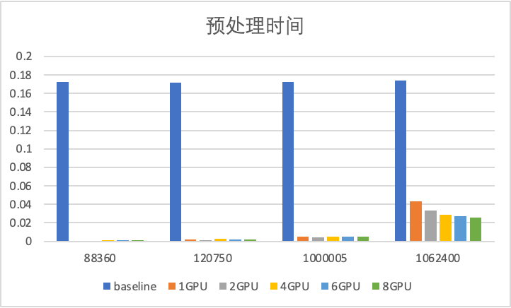
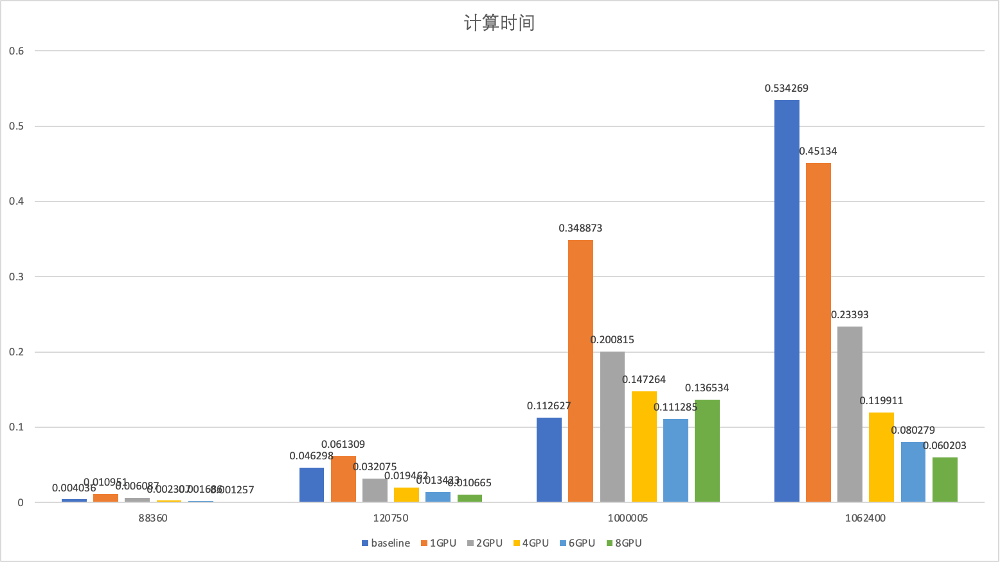

# 稀疏矩阵乘法（挑战作业）

## 任务描述

本任务为在多个GPU上对稀疏矩阵乘法进行优化。

优化的代码为spgemm-optimized.cu，采用所有4个节点的GPU（每个进程一个GPU），使用下面的命令去运行：

```shell
make
./run_all.sh benchmark-optimized 4 8 1
```

## 稀疏矩阵乘法基本算法

整个流程包含两步：计算非零元个数和计算最终结果。

分成两步的关键在于第二步的存储空间需要根据第一步的结果而通过 `cudaMalloc`或者 `Malloc`出来。

### 计算非零元个数

假设矩阵乘法为 `C=A x B`

首先枚举A矩阵的每一行i，根据CSR格式枚举列元素j，在B矩阵中根据行j的信息枚举列k，对于(i,k)产生一次贡献。

为了能准确计算出非零元个数，我们需要对于k进行去重，考虑到我们需要将这个算法放在GPU上进行加速，我们采用哈希的方式进行优化。

假设哈希表大小 `HASH_COUNT=2^T`，我们令哈希函数为 `F(x)=(x & (HASH_COUNT - 1))`，这样比较容易计算。

如果不巧出现哈希冲突，做法为向后（如果到了HASH_COUNT则回到0）继续找直到找到第一个空位，把数据放在其中。

这种算法比较简单且容易实现。

### 计算最终结果

类似于计算非零元个数的过程，唯一的差异在于不仅仅是在k的位置产生一次贡献，而需要把矩阵的值乘起来加在k所在的位置。

因此需要在同样的哈希表中开一个对应的数据存储列表，在对应哈希值存在表时，需要把新的值累加在对应位置。

## 优化算法

### GPU并行优化——计算结果

在GPU中，可以利用其高并发度进行并行优化。

这里并不是对于行进行切分，而是对于同一行里面的不同列进行切分（Kernel并行度为32），如下面代码所示：

```cpp
    int rid = blockIdx.x; //行的编号
    int tid = threadIdx.x; //列的并行单元编号
```

首先初始化哈希表，这里可以利用__share__把数据放在共享显存中（同一组线程共享数据），哈希表的初始化可以每个线程初始化一部分。

```cpp
    for (int i = tid; i < HASH_SIZE; i += 32) {
        hash_idx[i] = -1;
        hash_values[i] = 0;
    }
    __syncthreads();
```

最后利用 `__syncthreads`方式同步所有线程。

接下来按照每个线程计算每一部分来处理，这里需要注意的是由于哈希表是需要共同访问的所有需要用 `atomicCAS`来进行原子操作。

```cpp
    for (int i = matA->gpu_r_pos[rid] + tid; i < matA->gpu_r_pos[rid + 1]; i += 32) {
        int pj = matA->gpu_c_idx[i];
        data_t vj = matA->gpu_values[i];

        for (int j = matB->gpu_r_pos[pj]; j < matB->gpu_r_pos[pj + 1]; j++) {
            int pk = matB->gpu_c_idx[j];
            int hash = (pk & (HASH_SIZE - 1));
            while (atomicCAS(&hash_idx[hash], -1, pk) != -1) {
                if (hash_idx[hash] == pk) {
                    break;
                }
                hash = ((hash + 1) & (HASH_SIZE - 1));
            }
            atomicAdd(&hash_values[hash], matB->gpu_values[j] * vj);
        }
    }
```

在所有数据插入哈希表之后，我们遍历整个哈希表，得到最终的数组。

```cpp
    __syncthreads();
    int start = matC->gpu_r_pos[rid];
    for (int i = tid; i < HASH_SIZE; i += 32) {
        if (hash_idx[i] != -1) {
            int pos = atomicAdd(&nzz, 1) + start;
            matC->gpu_c_idx[pos] = hash_idx[i];
            matC->gpu_values[pos] = hash_values[i];
        }
    }
```

### GPU并行优化——统计数量

统计数量依然需要用到哈希表，这里主要是把后面如何统计的方法介绍一下。

统计数量方法和计算结果类似，每个线程的结果放在 `row_nzz` 中：

```cpp
    int row_nzz = 0, cal = 0;
    for (int i = matA->gpu_r_pos[rid] + tid; i < matA->gpu_r_pos[rid + 1]; i += 32) {
        int pj = matA->gpu_c_idx[i];

        for (int j = matB->gpu_r_pos[pj]; j < matB->gpu_r_pos[pj + 1]; j++) {
            int pk = matB->gpu_c_idx[j];
            int hash = (pk & (HASH_COUNT_MAX - 1));
            while (atomicCAS(&hash_idx[hash], -1, pk) != -1) {
                if (hash_idx[hash] == pk) {
                    row_nzz--;
                    break;
                }
                hash = ((hash + 1) & (HASH_COUNT_MAX - 1));
            }
            row_nzz++;
        }
        cal += matB->gpu_r_pos[pj + 1] - matB->gpu_r_pos[pj];
    }

    __syncthreads();
```

后面采用规约方法（Reduction）统计到所有线程之和：

```c
    row_nzz += __shfl_xor_sync(int(-1), row_nzz, 16);
    row_nzz += __shfl_xor_sync(int(-1), row_nzz, 8);
    row_nzz += __shfl_xor_sync(int(-1), row_nzz, 4);
    row_nzz += __shfl_xor_sync(int(-1), row_nzz, 2);
    row_nzz += __shfl_xor_sync(int(-1), row_nzz, 1);
```

最后在第一个线程统计结果，并把大于HASH_COUNT的数量进行更新，并统计小于HASH_COUNT的最大值：

```cpp
    __syncthreads();
    if (tid == 0) {
        nzzC[rid] = row_nzz;
        if (row_nzz > HASH_COUNT) {
            int pos = atomicAdd(&limit[0], 1);
            limit_pos[pos] = rid;
        }
        else {
            atomicMax(&limit[1], row_nzz);
        }
        // calA[rid] = cal;
    }
```

## 存在的问题

在偏随机的稀疏矩阵乘法中，最终每一行结果数量不会太多（比如第三次作业的矩阵），基本上哈希表开成2048即可通过。但在比较特殊构造的矩阵的乘法中，这种方式是无法通过的，比如这次的第三个测试点，最长的结果行有12000+个数据，这种方式下需要将哈希表开到16384，然而对于share内存NVCC存在限制，因此需要想一个解决的方法。

### 动态开显存

首先在统计数量时，我们在GPU kernel前先把申请的share memory大小从48KB变成64KB。

```cpp
cudaFuncSetAttribute(calculate_nzz, cudaFuncAttributeMaxDynamicSharedMemorySize, 65536);
```

接下来在Kernel的调用时，我们动态申请空间，下面是调用Kernel的方法：

```cpp
calculate_nzz << <dimGrid1, dimBlock1, HASH_COUNT_MAX * sizeof(int) >> > 
```

前个参数是Kernel的Grid数和Block数，第三个参数为动态申请share memory大小，在Kernel内部这样使用：

```cpp
    extern __shared__ int h_int[];
    int* hash_idx = (int*)h_int;
    for (int i = tid; i < HASH_COUNT_MAX; i += 32) {
        hash_idx[i] = -1;
    }
```

通过extern关键字得到共享内存的虚拟地址，这里HASH_COUNT_MAX我们取16384，可以保证所有行都能统计数量。

### 单独统计较长行

在统计数量的过程中，我们需要把数量超过4096的行单独列出来，如Kernel所示：

```cpp
    if (tid == 0) {
        nzzC[rid] = row_nzz;
        if (row_nzz > HASH_COUNT) {
            int pos = atomicAdd(&limit[0], 1);
            limit_pos[pos] = rid;
        }
        else {
            atomicMax(&limit[1], row_nzz);
        }
        // calA[rid] = cal;
    }
```

这是因为在第二步计算结果时，由于16384的哈希表加统计结果超过了64KB，因此我们单独处理超过4096行的部分。而当哈希表仅开4096时，可以支持哈希表加上统计结果数组。Kernel中limit[0]表示的就是超过4096的数目，他们会被单独存放在数组limit_pos中。

### 单独计算较长行

较长行的数据统计我们采用一个特殊的Kernel：`calculate_values_large`，在这个Kernel中，哈希表依然采用share memory，但是哈希表存储的值则放在了显存中，每一个较长行一个哈希表存储序列，这部分空间在调用Kernel之前先申请出来空间。

```cpp
    extern __shared__ int h_int[];
    int* hash_idx = (int*)h_int;
    data_t* hash_values = valuess + blockIdx.x * HASH_COUNT_MAX;

    for (int i = tid; i < HASH_COUNT_MAX; i += 32) {
        hash_idx[i] = -1;
        hash_values[i] = 0;
    }
    __syncthreads();
```

上面代码是唯一和原本 `calculate_values` 不一样的地方，hash_values数组通过索引找到。

### 减少计算结果哈希表

为了提高性能，可以发现对于不超过4096的行，哈希表大小仅需要开到不小于最长行的2的幂即可，因此在第一次统计数量的时候会单独计算最长行。在得到这个结果后，会通过枚举算出不少于最长行的2的幂，后面在计算结果的哈希表大小即为这个值。

## 多GPU任务划分

前面描述了在单个GPU上的做法，在这个超算平台上每个节点有两块GPU，总共4个节点，尝试去利用所有这些计算资源。

### 矩阵任务切分

假设进程数量为K，矩阵的每一行i按照取模的方式分配到第i%K个进程，因此首先需要先对整个矩阵进行切分，分配给不同进程中，首先开下面两个数组：

```cpp
    dist_matrix_t matA_d[PROCESS_COUNT], matC_d[PROCESS_COUNT];
```

在分配过程中，我们需要同时修改r_pos、c_idx和values数组，这个按照CSR格式重新构建矩阵：

```cpp
    for (int i = 0; i < mat.global_m; i++) {
        int idx = i % PROCESS_COUNT;
        matA_d[idx].global_nnz += mat.r_pos[i + 1] - mat.r_pos[i];
        matA_d[idx].dist_m++;
    }
    for (int i = 0; i < PROCESS_COUNT; i++) {
        matA_d[i].r_pos = (index_t*)malloc((matA_d[i].dist_m + 1) * sizeof(index_t));
        matA_d[i].r_pos[0] = 0;
        matA_d[i].c_idx = (index_t*)malloc((matA_d[i].global_nnz) * sizeof(index_t));
        matA_d[i].values = (data_t*)malloc((matA_d[i].global_nnz) * sizeof(data_t));
    }
    for (int i = 0; i < mat.global_m; i++) {
        int m_idx = i % PROCESS_COUNT, p_idx = i / PROCESS_COUNT;
        int start = matA_d[m_idx].r_pos[p_idx];
        for (int j = mat.r_pos[i]; j < mat.r_pos[i + 1]; j++) {
            matA_d[m_idx].c_idx[start] = mat.c_idx[j];
            matA_d[m_idx].values[start] = mat.values[j];
            start++;
        }
        matA_d[m_idx].r_pos[p_idx + 1] = start;
    }
```

构建完毕后这样每个matA_d就仅仅是一部分行了，新增加的dist_m用于统计新的行数。

### 矩阵运算

在进行矩阵运算时，每个进程直接调用spgemm函数用于计算即可

```cpp
    spgemm(&matA_d[my_pid], &matB, &matC_d[my_pid]);
```

这样每个进程都能平均负载，有效提高系统的整体性能。

### 结果整合

最后我们通过MPI方式将所有结果发送到0号进程中，每个非0号进程通过下面的方式把数据发送到0好进程中：

```cpp
    MPI_Isend(&(matC_d[my_pid].global_nnz), 1, MPI_INT, 0, 0, MPI_COMM_WORLD, &request[(my_pid - 1) * 4]);
    MPI_Isend(matC_d[my_pid].r_pos, matA_d[my_pid].dist_m + 1, MPI_INT, 0, 1, MPI_COMM_WORLD, &request[(my_pid - 1) * 4 + 1]);
    MPI_Isend(matC_d[my_pid].c_idx, matC_d[my_pid].global_nnz, MPI_INT, 0, 2, MPI_COMM_WORLD, &request[(my_pid - 1) * 4 + 2]);
    MPI_Isend(matC_d[my_pid].values, matC_d[my_pid].global_nnz, MPI_FLOAT, 0, 3, MPI_COMM_WORLD, &request[(my_pid - 1) * 4 + 3]);

    MPI_Waitall(4, request + ((my_pid - 1) * 4), MPI_STATUS_IGNORE);
```

这里我们通过MPI_Waitall方式可以等待所有请求完成，这里我们需要先发送 `global_nnz`这个变量，是因为我们需要在接收端申请新的空间。

在接收端接受这些数据请求：

```cpp
    for (int i = 1; i < PROCESS_COUNT; i++) {
        MPI_Irecv(&(matC_d[i].global_nnz), 1, MPI_INT, i, 0, MPI_COMM_WORLD, &request[(i - 1) * 4]);
        MPI_Wait(&request[(i - 1) * 4], MPI_STATUS_IGNORE);
        matC_d[i].r_pos = (index_t*)malloc((matA_d[i].dist_m + 1) * sizeof(index_t));
        matC_d[i].c_idx = (index_t*)malloc((matC_d[i].global_nnz) * sizeof(index_t));
        matC_d[i].values = (data_t*)malloc((matC_d[i].global_nnz) * sizeof(data_t));

        MPI_Irecv(matC_d[i].r_pos, matA_d[i].dist_m + 1, MPI_INT, i, 1, MPI_COMM_WORLD, &request[(i - 1) * 4 + 1]);
        MPI_Irecv(matC_d[i].c_idx, matC_d[i].global_nnz, MPI_INT, i, 2, MPI_COMM_WORLD, &request[(i - 1) * 4 + 2]);
        MPI_Irecv(matC_d[i].values, matC_d[i].global_nnz, MPI_FLOAT, i, 3, MPI_COMM_WORLD, &request[(i - 1) * 4 + 3]);
        MPI_Waitall(3, request + (i - 1) * 4 + 1, MPI_STATUS_IGNORE);
     }
```

这样我们就可以在0号进程中得到所有分矩阵大小了，最后我们类似于矩阵任务切分的方式，重新把矩阵进行整合：

```cpp
    matC.global_m = matC_d[0].global_m;
    for (int i = 0; i < PROCESS_COUNT; i++) {
        matC.global_nnz += matC_d[i].global_nnz;
    }
    matC.r_pos = (index_t*)malloc((matC.global_m + 1) * sizeof(index_t));
    matC.c_idx = (index_t*)malloc(matC.global_nnz * sizeof(index_t));
    matC.values = (data_t*)malloc(matC.global_nnz * sizeof(data_t));
    int cnt = 0;
    matC.r_pos[0] = 0;
    for (int i = 0; i < matC.global_m; i++) {
        int m_idx = i % PROCESS_COUNT, p_idx = i / PROCESS_COUNT;
        for (int j = matC_d[m_idx].r_pos[p_idx]; j < matC_d[m_idx].r_pos[p_idx + 1]; j++) {
            matC.c_idx[cnt] = matC_d[m_idx].c_idx[j];
            matC.values[cnt] = matC_d[m_idx].values[j];
            cnt++;
        }
        matC.r_pos[i + 1] = cnt;
    }
```

## 实验结果分析

### 预处理时间分析



可以发现相比于cuSPARSE库，任何GPU数量的预处理时间都更加省时间。

而且更多的GPU数目并没有带来更多的预处理开销。

### 计算时间分析



可以发现除了第三个点，8个GPU性能远远好于cuSPARSE库的方法，且在矩阵大小为1062400的矩阵上达到了8.8倍的提升。

通过观察倍数曲线可以发现随着GPU数量的提升，系统性能的提升倍数在不断收敛，证明除了并行部分，串形部分的性能逐渐成为系统的性能瓶颈。

第三个点为构造的矩阵，其特征为结果的每一行都比较长。证明本方法在随机稀疏矩阵中的性能会更好一些，而在结果比较稠密的矩阵中并不能得到更好的效果（可以发现8个GPU性能没有cuSPARSE库要好，而6个GPU性能比cuSPARSE库要好，说明负载均衡对于系统的重要意义）。
